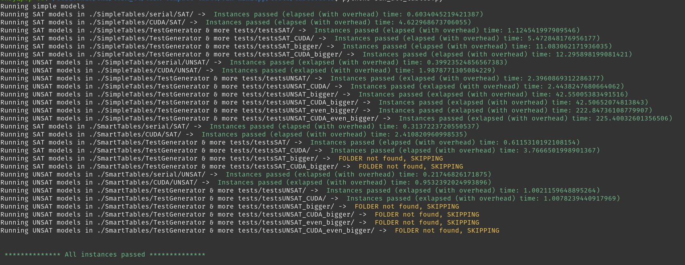

# CUDA-compact-table

The main branch integrating the constaint in MiniCPP.
Test results of this branch:

The repository, has multiple branches, which implement the constraint with or without bitsets and with or without streams.
